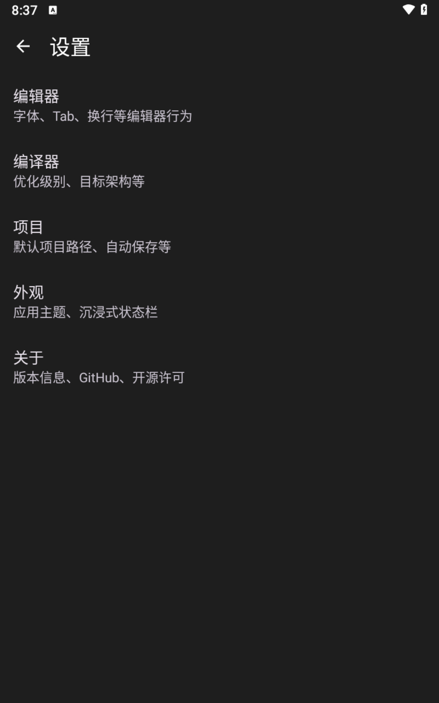
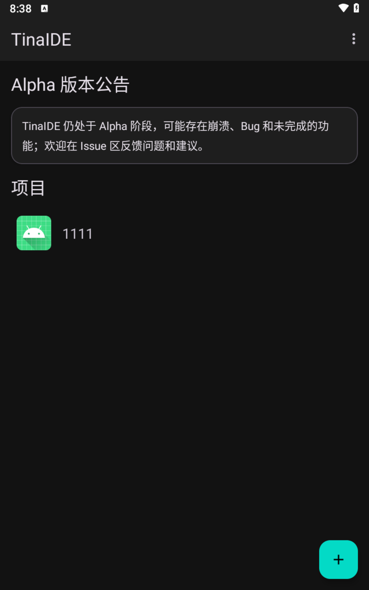

# TinaIDE

> 在 Android 设备上运行的轻量级 C/C++ IDE

[English](README_EN.md)

---

TinaIDE 是一个专为 Android 设备设计的集成开发环境，支持在手机或平板上直接编写、编译和运行 C/C++ 代码。内置完整的 Clang/LLVM 工具链和 clangd 语言服务器，提供接近桌面 IDE 的开发体验。

## 分支说明

本项目采用多分支开发模式，不同分支对应不同的功能特性和开发阶段：

### 主要分支

| 分支 | 状态 | 说明 |
|------|------|------|
| **`opensource-llvm-latest`** | 🚀 **主分支（推荐）** | 最新稳定版本，完整的 LLVM/Clangd 集成 + 实时诊断 |
| `main` | 📦 稳定版本 | 集成 PRoot + Termux 终端模拟器，支持完整 Linux 环境 |
| `feature/simple-lsp` | 🔧 LSP 优化 | 简化的 LSP 客户端实现，LLD 进程隔离 |

### 功能分支

| 分支 | 功能特性 | 适用场景 |
|------|---------|---------|
| `feat/integrate-termux-app` | 集成 AIDE-Termux 模块，完整终端支持 | 需要终端环境和包管理器 |
| `feat/proot-rootfs` | PRoot 根文件系统实验 | Linux 容器化运行环境 |
| `exp-cmake-ninja-sysroot` | CMake + Ninja + xmake 构建系统集成 | 复杂项目构建支持 |
| `feature/clangd-diagnostics` | Clangd 诊断功能开发（已合并到主分支） | 实时错误检测 |
| `feature/lld-server-dlclose` | LLD 链接器隔离模式（已合并到主分支） | 链接器稳定性优化 |

### 推荐使用主分支

```bash
# 克隆仓库并切换到主分支
git clone https://github.com/wuxianggujun/TinaIDE.git
cd TinaIDE
git checkout opensource-llvm-latest

# 或者直接克隆主分支
git clone -b opensource-llvm-latest https://github.com/wuxianggujun/TinaIDE.git
```

### 分支详细说明

#### 🚀 opensource-llvm-latest（主分支）

**核心特性**:
- ✅ **完整的 Clang/LLVM 17 工具链** - 进程内编译，无需外部工具
- ✅ **实时诊断功能** (v1.0.154-155) - 编辑时实时显示错误和警告
- ✅ **优化的 LSP 服务** - 使用 nlohmann/json 库进行稳定的 JSON 解析
- ✅ **LLD 链接器隔离模式** - dlopen/dlclose 机制避免全局状态污染
- ✅ **智能代码补全** - 语义级补全、跳转定义、查找引用
- ✅ **Tree-sitter 语法高亮** - C/C++/CMake 支持
- ✅ **完善的文档** - 架构文档、开发指南、API 文档

**适用场景**: 日常 C/C++ 开发、学习编译原理、移动端 IDE 开发

**版本历史**:
- **v1.0.155** (2025-12-10) - 使用 nlohmann/json 重构诊断解析
- **v1.0.154** (2025-12-10) - 实现 Clangd 诊断功能完整数据流

#### 📦 main（稳定版本）

**核心特性**:
- ✅ **PRoot 集成** - 支持 LINKER64 模式，完整 Linux 环境
- ✅ **Termux 终端模拟器** - 集成终端，支持命令行操作
- ✅ **基础编译功能** - Clang/LLVM 编译器支持
- ✅ **文件管理** - 项目文件树导航

**适用场景**: 需要完整 Linux 环境、终端操作、包管理器

**最新更新**: v0.6.91 - 修复 PRoot LINKER64 启动问题

#### 🔧 feature/simple-lsp（LSP 优化）

**核心特性**:
- ✅ **简化的 LSP 客户端** - 直接 pipe 通信，降低延迟
- ✅ **LLD 进程隔离** - 独立链接服务器，提高稳定性
- ✅ **文件树懒加载** - 优化大型项目加载性能
- ✅ **输出面板增强** - 构建日志、诊断信息分离显示
- ✅ **自动版本管理** - Gradle 自动递增版本号
- ✅ **代码混淆** - Release 构建优化

**适用场景**: LSP 性能优化、大型项目开发

#### 🔧 feat/integrate-termux-app（Termux 集成）

**核心特性**:
- ✅ **AIDE-Termux 模块** - 完整的 Termux 环境
- ✅ **多架构支持** - arm64-v8a, armeabi-v7a, x86, x86_64
- ✅ **包管理器** - apt/pkg 包管理支持
- ✅ **终端工具链** - bash, vim, git 等工具

**适用场景**: 需要完整 Linux 工具链、终端开发环境

**注意事项**:
- 模拟器兼容性问题（工具栏重叠）
- 需要 Legacy External Storage 权限（API 29）

#### 🔧 exp-cmake-ninja-sysroot（构建系统集成）

**核心特性**:
- ✅ **CMake 支持** - 标准 CMake 项目构建
- ✅ **Ninja 构建** - 快速增量编译
- ✅ **xmake 集成** - 现代化构建工具支持
- ✅ **tbox 库支持** - Android 平台适配

**适用场景**: 复杂项目构建、多构建系统支持

### 分支选择建议

| 需求 | 推荐分支 |
|------|---------|
| 日常 C/C++ 开发 | `opensource-llvm-latest` |
| 需要终端环境 | `main` 或 `feat/integrate-termux-app` |
| LSP 性能优化 | `feature/simple-lsp` |
| 复杂项目构建 | `exp-cmake-ninja-sysroot` |
| 学习编译原理 | `opensource-llvm-latest` |

更多版本信息请查看 [CHANGELOG.md](CHANGELOG.md)

## 特性

- **嵌入式编译器**: 内置 Clang/LLVM 17，进程内编译，无需外部工具
- **智能代码补全**: 集成 clangd LSP，提供精准的语义级代码补全
- **语法高亮**: 基于 Tree-sitter 的高性能增量语法高亮
- **代码导航**: 跳转定义、查找引用、悬浮文档
- **实时诊断**: 编辑时实时显示错误和警告
- **现代编辑器**: 基于 Sora Editor，支持多标签编辑
- **Material Design 3**: 遵循最新 Material Design 设计语言
- **进程内运行**: 编译后直接在应用内运行程序

## 界面预览


**代码编辑器**：主编辑器正在编写 `main.cpp`，示例输出 "Hello, 1111!"。


**设置中心**：在"设置"页配置编辑器、编译器、项目与外观等行为。


**项目主页**：启动页展示 Alpha 公告及项目列表，右下角按钮可创建新项目。


**智能补全**：clangd 提供上下文感知的关键字、类型与函数提示。

## 核心功能

### 编译器集成

| 功能 | 说明 |
|------|------|
| 进程内编译 | Clang/LLVM 以动态库形式集成，无需 fork 外部进程 |
| LLD 链接器 | 使用 LLVM LLD 进行快速链接（进程隔离模式） |
| 共享库输出 | 编译为 .so 文件，支持进程内加载运行 |
| 完整 Sysroot | Android NDK 头文件和运行时库 |

### LSP 语言服务

| 功能 | 说明 |
|------|------|
| 代码补全 | 语义级智能补全，支持成员访问、头文件、宏等 |
| 跳转定义 | 快速跳转到函数、变量、类型的定义位置 |
| 查找引用 | 查找符号在项目中的所有使用位置 |
| 悬浮文档 | 光标悬停显示类型信息和文档 |
| 实时诊断 | 编辑时实时检测语法和语义错误 |

### 编辑器功能

| 功能 | 说明 |
|------|------|
| 多标签编辑 | 同时打开多个文件，快速切换 |
| Tree-sitter 高亮 | C/C++/CMake 语法高亮 |
| 符号输入栏 | 快速输入编程符号（括号、运算符等）|
| 撤销/重做 | 完整的编辑历史支持 |
| 自动缩进 | 智能代码缩进 |
| 行号显示 | 可配置的行号区域 |

### 项目管理

| 功能 | 说明 |
|------|------|
| 文件树导航 | 抽屉式项目文件浏览器 |
| 项目模板 | 内置单文件项目模板 |
| compile_commands.json | 自动生成，为 LSP 提供编译配置 |

### 底部面板

| 标签 | 功能 |
|------|------|
| 构建日志 | 显示编译输出和错误信息 |
| 日志 | 通用应用日志 |
| 诊断 | LSP 诊断信息列表，点击可跳转 |

## 快速开始

### 1. 构建工具链

```powershell
# 构建 LLVM/Clang 工具链（首次需要 30-60 分钟）
pwsh ./docker/llvm-build/build-local.ps1 -Abi arm64-v8a -ApiLevel 28

# 同步到项目
pwsh ./tools/sync-llvm-build.ps1 -Abi arm64-v8a -ApiLevel 28
```

### 2. 构建应用

```bash
# 构建并安装（Debug 版本）
./gradlew installDebug

# 构建 Release 版本（需配置签名）
./gradlew assembleRelease
```

### 3. 开始使用

1. 启动应用（首次启动会自动解压 sysroot，约需 1-2 分钟）
2. 创建新项目或打开现有项目
3. 编写代码（LSP 自动提供补全和诊断）
4. 点击运行按钮编译并执行

详细步骤请查看 [快速开始指南](docs/快速开始.md)

## 文档

- [快速开始](docs/快速开始.md) - 从零开始使用 TinaIDE
- [架构概览](docs/架构概览.md) - 了解项目架构
- [开发指南](docs/开发指南.md) - 参与项目开发
- [文档中心](docs/README.md) - 完整文档索引
- [更新日志](CHANGELOG.md) - 版本更新历史

### 技术文档

- [Clang/LLVM 集成路线图](docs/CLANG_INTEGRATION_ROADMAP.md)
- [LSP 集成指南](docs/LSP-Integration.md)
- [Native 编译运行方案](docs/Native-Compile-Runtime.md)
- [底部面板使用指南](docs/Bottom-Panel-Guide.md)

## 技术栈

| 类别 | 技术 |
|------|------|
| 语言 | Kotlin, C++ |
| UI 框架 | Android View + Material Design 3 |
| 编辑器 | [Sora Editor](https://github.com/Rosemoe/sora-editor) |
| 语法高亮 | Tree-sitter (C/C++/CMake) |
| 编译器 | Clang/LLVM 17 |
| 链接器 | LLD |
| LSP 服务 | clangd (嵌入式) |
| 异步处理 | Kotlin Coroutines |
| 构建系统 | Gradle + CMake |
| 依赖注入 | 自定义 ServiceLocator |

## 支持的架构

| 架构 | 状态 | 用途 |
|------|------|------|
| `arm64-v8a` | ✅ 主要支持 | 真机 |
| `x86_64` | ✅ 支持 | 模拟器 |

**目标 API Level**: 28+ (Android 9.0+)
**编译 SDK**: 36 (Android 16)

## 系统要求

### 开发环境

- Android Studio (最新稳定版)
- JDK 17+
- Docker Desktop（用于构建 LLVM）
- PowerShell 7+

### 运行环境

- Android 9.0+ (API 28+)
- 推荐 3GB+ RAM
- 推荐 800MB+ 可用存储（含 sysroot）

## 项目结构

```
TinaIDE/
├── app/
│   └── src/main/
│       ├── java/.../tinaide/
│       │   ├── core/           # 核心服务（编译、配置、LSP配置）
│       │   ├── editor/         # 编辑器相关（语言支持、主题）
│       │   ├── lsp/            # LSP 服务和项目管理
│       │   ├── ui/             # UI 组件（Fragment、Dialog、Adapter）
│       │   └── utils/          # 工具类
│       └── cpp/
│           ├── compiler/       # Clang 编译器 JNI
│           ├── linker/         # LLD 链接器 JNI
│           ├── lsp/            # clangd 服务 JNI
│           └── treesitter/     # Tree-sitter 语法高亮
├── external/
│   ├── sora-editor/            # 编辑器子模块
│   └── llvm-build-libs/        # LLVM 预编译库
├── treeview/                   # 文件树组件
└── docs/                       # 项目文档
```

## 致谢

- [LLVM Project](https://llvm.org/) - 编译器基础设施
- [Sora Editor](https://github.com/Rosemoe/sora-editor) - 代码编辑器
- [Tree-sitter](https://tree-sitter.github.io/) - 语法高亮解析器
- [clangd](https://clangd.llvm.org/) - C/C++ 语言服务器

---

**让移动开发更自由**
